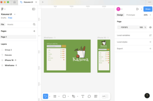

# Kasuwa- A Grocery Todo-List Web Application

This project is my submission for the Altschool Karatu session, semester 3 assignment for the Frontend Engineering track. The todo list web application was built with Vite, Vue, Vanilla CSS and Javascript. It was designed to fetch and display static information from a [JSONPlaceholder](https://jsonplaceholder.typicode.com/todos) and contains features such as pagination, search and filter, and the ability to view detailed description of each todo item. The application is hosted on Vercel.

## Features

### 1. Todo Listing
* Displays a list of all the todos contained within the JSONPlaceholder REST API.
* Pagination implemented to navigate through the todos in batches.
    * Users can also set how many repositories they want to see per page. 
* A search and filter functionality was added to find the names of each grocery item and to sort by status.

### 2. Todo Details
* Clicking on a single todo from the list opens a dedicated page with detailed information about that specific todo task.
* Nested routing is used to display todo details while maintaining the overall application layout structure.

### 3. Error Boundary
* Implements an Error Boundary component to catch and handle errors gracefully.
* A dedicated route/page is included in the navbar to test and showcase the Error Boundary functionality.

### 4. Error 404 Page
* The web app includes a custom 404 page to handle routes that don't exist within the application.
* A dedicated route/page is included in the navbar to test and showcase the 404 page.

### 5. Branding, UI Layout and Accessibility
The project is uniquely branded and given the name Kasuwa which means 'market' in the Hausa language. The idea is that the web app is a future grocery listing app that helps users intutively manage their grocery lists as they shop. The green-themed color scheme gives it a fresh and appealing vibe, perfectly suited for a grocery app like Kasuwa. The app's branding with the Kasuwa logo and its Hausa meaning adds a personal and cultural touch. The user interface was inspired from a Figma design originally developed by me. Screenshot below:

In addition, the web app includes some accessibility best practices taught in the first semester to ensure an inclusive experience - proper use of "main", "article", "section" tags among others.

## Bonus

CRUD functionalities have been included in this application.

#### A Modal to create new todo listings.

#### Editing of existing todos

#### Delete functuinality

#### LocalStorage to persist data as users interact with the application.

## Technologies Used 

* Vite: A modern build tool for React applications.
* Vue: A JavaScript framework for building user interfaces.
* Vanilla CSS: Regular CSS that is written without any pre-processors like SASS or LESS, and without any frameworks or libraries. Because it is fun! Hahaha.

## Deployment

The application is hosted on Vercel and can be accessed at: [https://alt-school-semester3-assignment.vercel.app/](https://alt-school-semester3-assignment.vercel.app/)

Assignment Submitted by Isioma Pamela Talabi.
